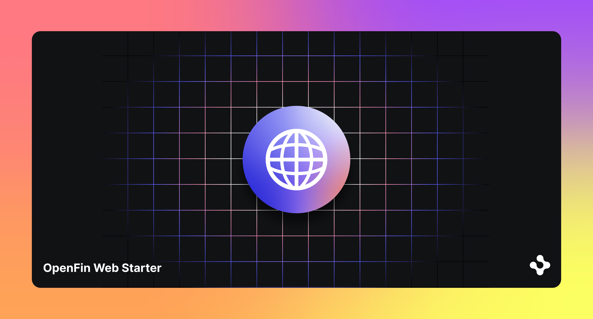

> **_:information_source: OpenFin:_** [OpenFin](https://www.openfin.co/) libraries are a commercial product and this repo is for evaluation purposes. Use of the OpenFin npm packages is only granted pursuant to a license from OpenFin. Please [**contact us**](https://www.openfin.co/contact/) if you would like to request a developer evaluation key or to discuss a production license.

## OpenFin Web

The OpenFin collection of web targetted npm packages are there to help you have an OpenFin experience across the desktop (container, workspace, native through our adapters or desktop browser) or tablets (through tablet browsers such as Safari).

[Learn more about openfin.co/](https://www.openfin.co/)

## What version does this branch cover?

This branch covers the release of our web offering.

## Before you get started

Read more about our [recommended development environment](https://developers.openfin.co/of-docs/docs/set-up-your-dev-environment).

We recommend:

- Using [Node.Js 18+](https://nodejs.org/en/about/previous-releases)
- Cloning this repo using: **git clone https://github.com/built-on-openfin/web-starter.git --depth=1** -As you only need the main branch to get started (it will always reflect the latest stable release).
- Opening the root web-starter folder in Visual Studio Code (instead of opening a how-to subfolder directly in Visual Studio Code) - this will give you access to all the samples.
- Running **npm install** from the root folder
- Running **npm run build** from the root folder - this will ensure every sample has all of it's dependencies and builds correctly (you can then open a terminal window or two at e.g. how-to/web-interop to build that specific sample or run sample specific commands)

## What you can do with this repository

This repository contains examples showing how to use or web npm packages and their related APIs.

### Web Interop

Want to learn how to use our Channel API, Interop API or FDC3 API inside of a desktop/tablet browser? This section provides a list of the available examples to learn more about our packages and APIs.

| Web Interop                                                            | Description                                                                                                                                                                                                     | Live Launch                                                                                                                                                                                                                                                                                                                                                                                                                                                                                                                                                              |
| ----------------------------------------------------------------------------- | --------------------------------------------------------------------------------------------------------------------------------------------------------------------------------------------------------------- | ------------------------------------------------------------------------------------------------------------------------------------------------------------------------------------------------------------------------------------------------------------------------------------------------------------------------------------------------------------------------------------------------------------------------------------------------------------------------------------------------------------------------------------------------------------------------ |
| [Web Interop Basic](./how-to/web-interop-basic) | This basic how-to provides a way of configuring a a webpage with a number of framed applications that share contextual information.                                                                |                                                                                                                                                                                                                                                                                       |
## General

| Documentation                                                                      | Description                                                                                                                                                                    | Live Launch |
| ---------------------------------------------------------------------------------- | ------------------------------------------------------------------------------------------------------------------------------------------------------------------------------ | ----------- |
| [Hints And Tips](./how-to/hints-and-tips)                                          | This is more a collection of hints and tips than an example. We will be building up this section over time as we come across points of interest while working on our examples. |             |

### Read more about these settings in [Workspace documentation](https://developers.openfin.co/of-docs/docs/workspace-override-options)
