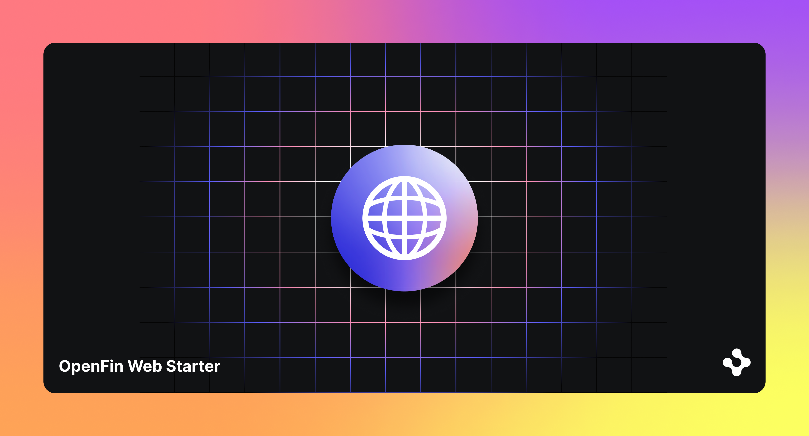

> **_:information_source: HERE:_** [HERE](https://www.here.io/) libraries are a commercial product and this repo is for evaluation purposes. Use of the HERE npm packages is only granted pursuant to a license from HERE. Please [**contact us**](https://www.here.io/contact/) if you would like to request a developer evaluation key or to discuss a production license.

## HERE Core Web - Known Issues


### [0.43.115](https://cdn.openfin.co/versions/?product=Core%20Web#0.43.115)

Due to Chrome's Local Network Access (LNA) restrictions, if you have a page served from localhost that embeds content via an iframe from an external HTTPS URL (or vice versa), this setup is now subject to LNA restrictions.
This will not pose a problem in production. Examples pointing to hosted urls should be run from the Live Launch links listed in the [GitHub page](https://github.com/built-on-openfin/web-starter). 

https://developer.chrome.com/release-notes/142#local_network_access_restrictions

### [0.40.31](https://www.npmjs.com/package/@openfin/core-web/v/0.40.31)

- title is now a supported type.

### [0.39.21](https://www.npmjs.com/package/@openfin/core-web/v/0.39.21)

- If you wish to specify a title for your view when adding it to a layout (so it shows on the tab for the view on the layout) using the new addView API you will need to either cast the view options as unknown and then OpenFin.ViewOptions or use @ts-expect-error.

```typescript
await window?.fin?.Platform.Layout.getCurrentSync().addView({
    name,
    url,
    // @ts-expect-error title will be exposed in the next release
    title: "Title to show on the layout tab"
   });
```

### [0.38.64](https://www.npmjs.com/package/@openfin/core-web/v/0.38.64)

- No known issues.

### [0.38.55](https://www.npmjs.com/package/@openfin/core-web/v/0.38.55)

#### Layout containing a section with more than one view

If you have more than one tab in a section, you must set reorderEnabled to false as it will be fully supported in a future release.

```js
{
    "type": "component",
    "componentName": "view",
    "componentState": {
    "name": "internal-generated-view-5392442d-4d19-4d71-bcf1-ca9081ec50b1",
    "url": "your url",
    "componentName": "view"
    },
    "title": "Your title",
    "reorderEnabled": false
},
```

This is being resolved in a future release.

#### Supporting Multiple Layouts containing a section with more than one view

If you have a section with e.g. three views and you select the third view and then switch layouts and switch back then the third view will still be focused but it will now be at positioned as the first tab.

This is being resolved in a future release.
