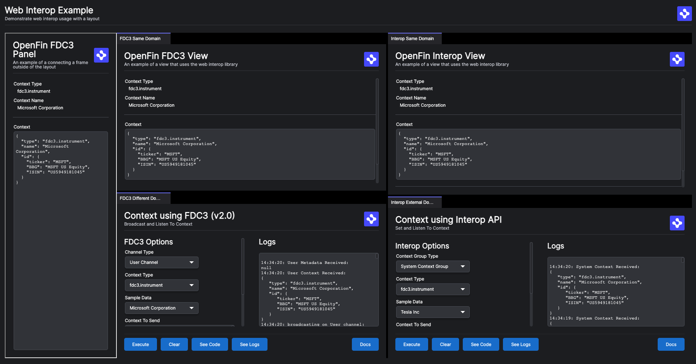
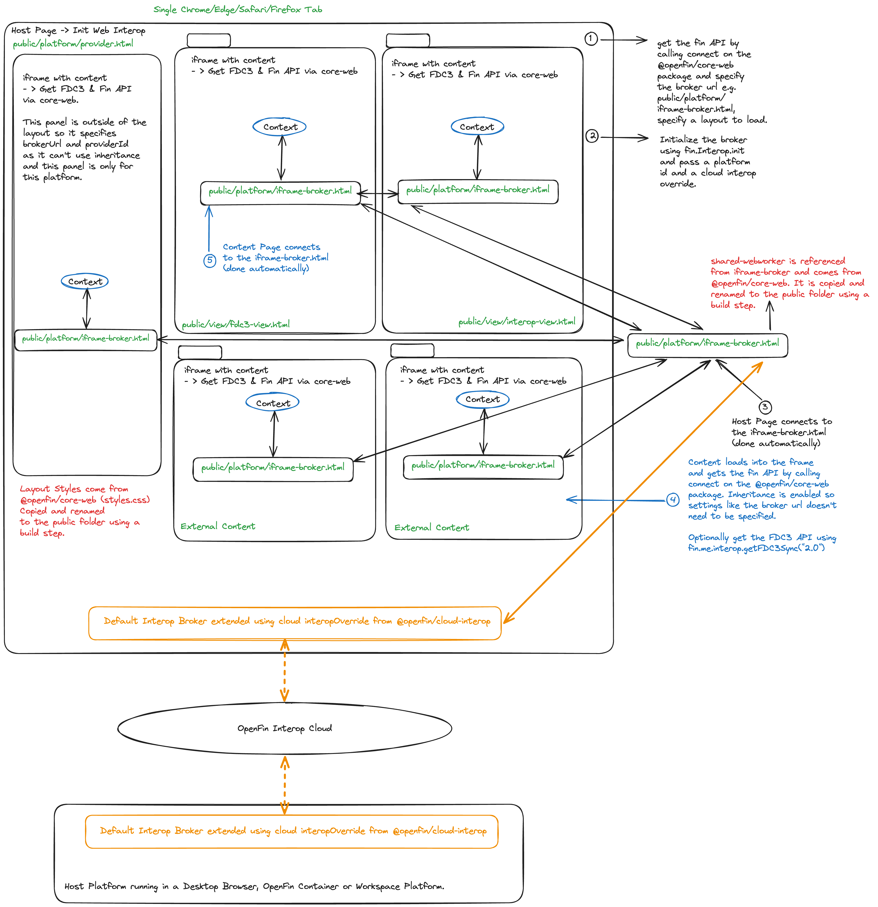

> **_:information_source: OpenFin:_** [OpenFin](https://www.openfin.co/) libraries are a commercial product and this repo is for evaluation purposes. Use of the OpenFin npm packages is only granted pursuant to a license from OpenFin. Please [**contact us**](https://www.openfin.co/contact/) if you would like to request a developer evaluation key or to discuss a production license.

# OpenFin Cloud Interop

This is our Web Interop example with Cloud Interop added.

This is a simple example that has a simple provider web page that acts as the main/index page. This page wires up the interop broker and a layout using the [@openfin/core-web](https://www.npmjs.com/package/@openfin/core-web) library and connects the web broker to the cloud using our [@openfin/cloud-interop](https://www.npmjs.com/package/@openfin/cloud-interop) npm package.

This page has a very simple layout which is made up of four iframes that inherit the interop settings they should use to connect to the web broker:

- Local - An FDC3 View - This uses the FDC3 API to add a context listener and to broadcast a hardcoded context object.
- Local - An Interop View - This uses the OpenFin Interop API to add a context listener and to set context using a hardcoded context object.
- External - An FDC3 Tool used in our workspace platform starters that lets you experiment with context sharing using the FDC3 APIs.
- External - An Interop Tool used in our workspace platform starters that lets you experiment with context sharing using the OpenFin Interop API.

It also has a left panel which is outside of the OpenFin Layout and represents a platform specific panel which simply uses fdc3 and logs what it receives. This iframe does not inherit interop settings (as it is not part of the OpenFin layout) and uses platform specific settings to connect.

[Live Launch Example](https://built-on-openfin.github.io/web-starter/web/v21.0.0/cloud-interop/platform/provider.html)



## Getting Started

1. Install dependencies and do the initial build. Note that these examples assume you are in the sub-directory for the example.

```shell
npm install
```

2. Build the example.

```shell
npm run build
```

3. Start the test server in a new window.

```shell
npm run start
```

4. Launch the sample in your default desktop browser (or copy <http://localhost:6060/platform/provider.html> into your Desktop Browser).

```shell
npm run client
```

## Setup Notes

There are a few things to note before trying to use @openfin/core-web:

- If your [tsconfig](./client/tsconfig.json) file is using **node** for moduleResolution it will need to use **Node16** instead as export/imports are defined in the package.json of the @openfin/core-web npm package. This is required for when you try to import @openfin/core-web/iframe-broker.
- You will need to copy the shared-worker.js file from the [@openfin/core-web](https://www.npmjs.com/package/@openfin/core-web) npm package to your public folder. We have created a [copy-core-web.js](./scripts/copy-core-web.js) script to do this and it is referenced in the build-client npm command.
- You will need to copy the styles.css file for styling the layout from the [@openfin/core-web](https://www.npmjs.com/package/@openfin/core-web) npm package to your public folder. We have created a [copy-core-web.js](./scripts/copy-core-web.js) script to do this and it is referenced in the build-client npm command.

## How things are structured

### Host

The host is the entry point and it is the page that gets loaded into the Chrome/Edge/Safari/Firefox tab.

It has a responsibility to create a connection providing a broker url and then initializing the broker providing an id (**this id will be needed by your content when it wishes to connect**).

In the sample we use a [settings](./client/src/platform/settings.ts) file that reads settings from the [web manifest file](./public/manifest.json) but this has been removed from the snippet to simplify the code snippet. We also have some checks for the cloud configuration but this has also been removed from this snippet.

```javascript
import { connect } from "@openfin/core-web";

/**
 * Initializes the OpenFin Web Broker connection.
 */
async function init(): Promise<void> {
 // Get the dom element that should host the layout
 const layoutContainer = document.querySelector<HTMLElement>("#layout_container");

 // Get the default layout
 const layoutSnapshot = {...};

 // Connect to the OpenFin Web Broker and pass the default layout.
 // It is good practice to specify providerId even if content is explicitly specifying it for cases where
 // this provider uses our layout system and content uses inheritance. currentContextGroup
 // is useful for defaulting any client that uses inheritance through our layout system.
 const fin = await connect({ options: {
  brokerUrl: "http://localhost:6060/platform/iframe-broker.html",
  interopConfig: {
   providerId: "web-interop",
   currentContextGroup: "green"
  }
 },
  connectionInheritance: "enabled",
  platform: { layoutSnapshot } });

// assign the fin api to the window object to make it globally available for consistency with container/workspace code. It also makes the
 // api available to libraries such as cloud interop.
 window.fin = fin;

 // These settings may be subject to change as we get feedback from use cases. Please contact OpenFin for this information.
 const cloudConfig =  {
  platformId: "<PLEASE ASK OPENFIN FOR A PLATFORM ID>",
  sourceId: "cloud-interop",
  authenticationType: "basic",
  basicAuthenticationParameters: {
     username: "<PLEASE ASK OPENFIN FOR A USERNAME>",
     password: "<PLEASE ASK OPENFIN FOR A PASSWORD>"
  },
  url: "<PLEASE ASK OPENFIN FOR A URL>"
 };

// You may now use the `fin` object and initialize the Broker with support for cloud interop.
 await fin.Interop.init("cloud-interop", [await cloudInteropOverride(cloudConfig)]);

 // initialize the layout and pass it the dom element to bind to
 await fin.Platform.Layout.init({
  container: layoutContainer
 });
}
```

The host html page [provider.html](./public/platform/provider.html) then:

- imports this code and initializes it.
- brings in required content through the @openfin/core-web layout system.
- brings in the required css for the @openfin/core-web layout system.

The host page initializes the OpenFin layout system and brings in a required css file that styles the layout system. This styles.css is brought in from the [@openfin/core-web](https://www.npmjs.com/package/@openfin/core-web) npm package. This style is copied to the public/style folder as core-web-styles.css using our [scripts/copy-core-web.js](./scripts/copy-core-web.js) script. It runs as part of the build process.

### IFrame Broker

This is the iframe that is referenced by the Host and Content Providers and it is how they communicate with each other. The iframe broker html page and the shared-webworker.js file have to reside on the same domain as the **host**.

The [iframe broker html page](./public/platform/iframe-broker.html) uses the shared-webworker.js file that comes as part of the [@openfin/core-web](https://www.npmjs.com/package/@openfin/core-web) npm package. This script is copied to the public/js folder as shared-worker.bundle.js using our [scripts/copy-core-web.js](./scripts/copy-core-web.js) script. It runs as part of the build process.

The iframe broker needs some initialization logic as well.

```javascript
import { init as initBrokerConnection } from "@openfin/core-web/iframe-broker";

/**
 * Initializes the OpenFin Web Broker connection.
 * @returns A promise that resolves when the connection is established.
 */
async function init(): Promise<void> {
 // The shared worker is copied and renamed to the public/js directory from the @openfin/core-web package
 // using the scripts/copy-shared-worker.js file that is called when npm run build is called.
 return initBrokerConnection({
  sharedWorkerUrl: "http://localhost:6060/js/shared-worker.bundle.js"
 });
}
```

### Content

Content refers to content that is framed within an iframe on the **host** html page. It establishes a connection to the **host** through the **iframe broker** via some initialization code.

Some things to note about the content provider setup:

- Content imports an init function from the [api.ts](./client/src/platform/api.ts) that creates the connection and assigns the window.fin and window.fdc3 APIs if they do not exist.
- You do not need to assign fdc3 or fin to the window object but we have done so for consistency with our workspace and container starter examples.
- The snippet below is the init function from the [api.ts](./client/src/platform/api.ts) file (although the settings function has been replaced with hard coded values for simplicity) that is imported and called.
- Content initializes the API and then runs code normally like it would inside of a workspace platform or container platform.
- the **finReady** event shown below is an example and doesn't exist in the OpenFin container as the API is injected into the document. We added **finReady** to have similar behavior to the **fdc3Ready** event that we also raise.

```javascript
import { connect } from "@openfin/core-web";

/**
 * Initializes the OpenFin Web Broker connection.
 */
export async function init(): Promise<void> {
 // Set window.fin to the `fin` object if needed.
 if (window.fin === undefined) {
   // Specify an interopConfig with a specific provider ID and a context group to initialize the `fin.me.interop` client on connection.
   window.fin = await connect({
      options: {
        brokerUrl: "http://localhost:6060/platform/iframe-broker.html",
        interopConfig: {
        providerId: "web-interop",
        currentContextGroup: "green"
        }
      }
   });
   console.log("Finished initializing the fin API.");
   // Create and dispatch the finReady event
   const event = new CustomEvent("finReady");
   window.dispatchEvent(event);
 }

 if (window.fdc3 === undefined && window?.fin?.me.interop?.getFDC3Sync !== undefined) {
   window.fdc3 = fin.me.interop.getFDC3Sync("2.0");
   console.log("Finished initializing the fdc3 API.");
   // Create and dispatch the FDC3Ready event
   const event = new CustomEvent("fdc3Ready");
   window.dispatchEvent(event);
 }
}
```

### Cloud

Once the extended interop broker initialized then a connection will be made to OpenFin's servers. Information shared across user channels (e.g. green) can then be made available to a second instance of this web platform (in another tab, on another browser or on another device) or a Workspace or Container based Platform (on the same machine or a different machine).

## Settings

To make it easier to update settings we store them in the web [manifest.json](./public/manifest.json) inside of _custom_settings_.

```json
{
  "name": "OpenFin Web Interop",
  "short_name": "OpenFinWebInterop",
  "start_url": "./platform/provider.html",
  "display": "standalone",
  "background_color": "#fff",
  "description": "An example showing a implementation of the OpenFin Web Interop Library.",
  "icons": [
    {
      "src": "common/images/icon-blue.png",
      "sizes": "72x72",
      "type": "image/png"
    }
  ],
  "related_applications": [],
  "custom_settings": {
    "platform": {
      "interop": {
        "sharedWorkerUrl": "http://localhost:6060/js/shared-worker.bundle.js",
        "brokerUrl": "http://localhost:6060/platform/iframe-broker.html",
        "providerId": "web-interop",
        "defaultContextGroup": "green"
      },
      "layout": {
        "panels": {
          "left": {
            "url": "http://localhost:6060/views/fdc3-panel.html",
            "frameId": "left-panel"
          }
        },
        "layoutContainerId": "layout_container",
        "defaultLayout": "http://localhost:6060/layouts/default.layout.fin.json"
      }
    },
    "cloud": {
      "connectParams": {
        "authenticationType": "basic",
        "basicAuthenticationParameters": {
          "username": "<PLEASE ASK OPENFIN/HERE FOR A USERNAME>",
          "password": "<PLEASE ASK OPENFIN/HERE FOR A PASSWORD>"
        },
        "platformId": "<PLEASE ASK OPENFIN/HERE FOR A PLATFORM ID>",
        "url": "<PLEASE ASK OPENFIN/HERE FOR A URL>",
        "sourceId": "cloud-interop"
      }
    }
  }
}
```

## A visual representation

We've covered the key pieces. We have a host, one or more pieces of content and a common iframe broker html page that is used to tie them altogether. We also use the OpenFin Layout system to render a layout that is compatible with the OpenFin container. This layout means that content doesn't need to know specific details about the host and it can inherit them. We also demonstrate content outside of the layout system by having a left panel example. This left panel specifies connection details. When initializing the broker we also use the our cloud interop support to tie this site with other sites using our cloud interop npm package.

This diagram is here to provide a rough visual guide to support the content above and the example:

