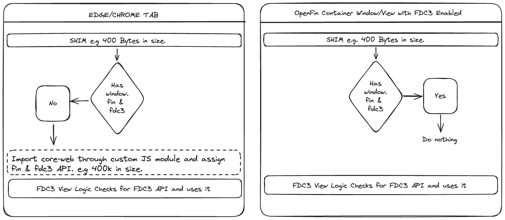

> **_:information_source: OpenFin:_** [OpenFin](https://www.openfin.co/) libraries are a commercial product and this repo is for evaluation purposes. Use of the OpenFin npm packages is only granted pursuant to a license from OpenFin. Please [**contact us**](https://www.openfin.co/contact/) if you would like to request a developer evaluation key or to discuss a production license.

# OpenFin Web Client API

This example is slightly different from the other examples. It isn't intended to be run directly but it is more an example of how content could reference a script/module provided by a platform that instantiates the fin and FDC3 API for them only if they happen to be running outside of the OpenFin container.

## Shim

The [shim](./client/src/shim.ts) script is small script that checks for the fin API and if it doesn't exist it imports a JavaScript module so that the fin and FDC3 APIs can be initialized.

The shim accepts the defaults apart from target. It passes a target to the JavaScript module (the window object) so that the fin and FDC3 API are assigned to the window so that code built for the OpenFin container will continue to run without change.

## Client

The [client](./client/src/client.ts) module is to be brought in when you are not running inside of an OpenFin container.

The client bundles the [@openfin/core-web](https://www.npmjs.com/package/@openfin/core-web) npm package and instantiates the fin and FDC3 API.

The module supports the following options:

- api - what APIs do you want to enable and what version of FDC3 should be instantiated (if you want to use a lower version of FDC3 you can pass the generic type for the 1.2 Agent). - default is true for both and FDC3 2.0.
- target - default is undefined as the init function returns an object with the requested APIs. If the target passed is the window then the function assigns the requests APIs to the window and raises the fdc3Ready event and a new finReady windows event (content should check for the existence of the API and listen for the ready event if it isn't available).
- logger - default is log to console but if you have your own logger you can pass it here and the function will use it.
- connect options - by default we specify inheritance true. If you need to specify your own @openfin/core-web settings then they can be passed here.

## Content

This is an FDC3 view similar to the one shown in web-interop and web-interop-basic examples. The only difference is that this one does not import the @openfin/core-web module. The [shim](./client/src/shim.ts) script is referenced in the [fdc3-view.html](./public/views/fdc3-view.html) page which is responsible for bringing in the fin and fdc3 api if the content is running outside of the container.

The content will not run directly as it is not running inside of a layout and the code required to setup a platform and initialize a layout has not been added in order to reduce the amount of code in this example. You can reference the hosted fdc3 example <https://built-on-openfin.github.io/web-starter/web/v18.0.0/client-web-api/views/fdc3-view.html> or start the web server and reference the localhost version <http://localhost:6060/views/fdc3-view.html>.

# Alternatives

This is just an example showing one approach. Content providers could reference the @openfin/core-web libraries directly, check for fin/fdc3 and then use [Webpack lazy loading](https://webpack.js.org/guides/lazy-loading/) to only fetch the module on demand if the required api was not available. Or they could import a module created by the platform that includes @openfin/core-web (like the [client](./client/src/client.ts) example) lazily.

## Getting Started

1. Install dependencies and do the initial build. Note that these examples assume you are in the sub-directory for the example.

```shell
npm install
```

2. Build the example.

```shell
npm run build
```

3. Start the test server if you want to reference the test page or shim script.

```shell
npm run start
```

## A visual representation

We've covered the key pieces. We have a small shim that only imports additional code when running outside of an OpenFin Container and we have an example html page that takes advantage of the shim.

This diagram is here to provide a rough visual guide to support the content above and the example:


