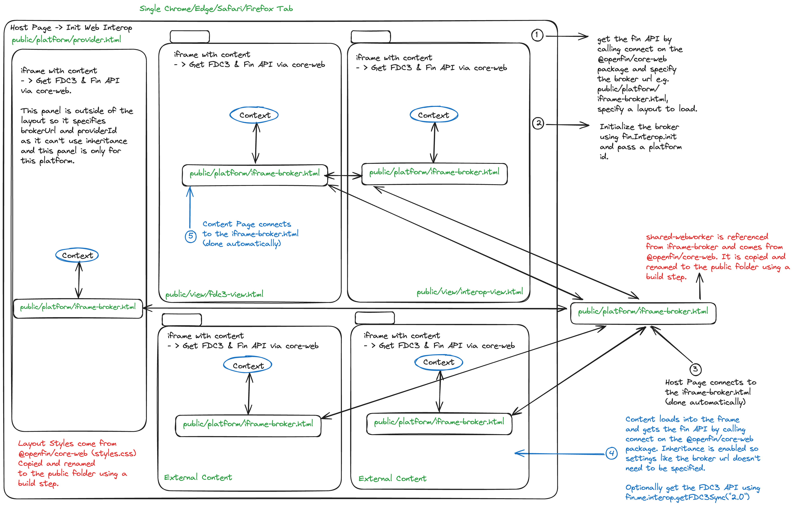

> **_:information_source: HERE:_** [HERE](https://www.here.io/) libraries are a commercial product and this repo is for evaluation purposes. Use of the OpenFin npm packages is only granted pursuant to a license from OpenFin. Please [**contact us**](https://www.here.io/contact/) if you would like to request a developer evaluation key or to discuss a production license.

# HERE - Web Interop Basic Intents

A minimal example of implementing an [FDC3 2.0](https://fdc3.finos.org/docs/2.0/fdc3-intro) intent flow using the [@openfin/core-web](https://www.npmjs.com/package/@openfin/core-web) library. It demonstrates the end-to-end lifecycle of raising an intent, resolving a target app, launching it, and delivering context to its intent listener.

It is not a complete implementation of the FDC3 2.0 spec, but rather a focused example to illustrate the core intent flow and how to use the `@openfin/core-web` library to implement an interop broker override.

## How It Works

The intent flow follows four steps:

1. A user selects an intent and context in the **Intents** view and calls `fdc3.raiseIntent(intent, context)`.
2. The **interop broker** receives the intent, searches the app directory for a matching app (by intent name and context type), and launches it as a new view.
3. The launched app connects to the broker and registers an intent listener via `fdc3.addIntentListener(intentName, handler)`.
4. The broker detects the listener registration and delivers the original intent context to the handler.



## What This Example Covers

- **Raising intents** -- Using the FDC3 2.0 `raiseIntent` API to send a typed context to a named intent.
- **Interop broker override** -- A custom `InteropBroker` that resolves intents against a static app directory, launches target apps, and waits for their intent handlers to register before delivering context.
- **Intent listeners** -- Views that call `addIntentListener` to receive and display intent context.
- **Client registration tracking** -- The broker tracks client connections and intent handler registrations so it knows when a newly launched app is ready to receive an intent.

## What This Example Does Not Cover

To keep complexity low and focus on the core intent flow:

- **No intent picker / resolver UI.** When an intent is raised, the broker matches the first app it finds that handles the intent and context type. In a full implementation, if multiple apps support the same intent, an intent resolver UI would let the user choose.
- **Limited FDC3 API surface.** Only `raiseIntent` and `addIntentListener` are demonstrated. Other FDC3 2.0 APIs such as `raiseIntentForContext`, `findIntent`, `findIntentsByContext`, `broadcast`, `addContextListener`, and `fdc3.open` are not implemented.
- **No context sharing on user channels.** This example focuses solely on intents. For context sharing via user channels, see the [web-interop-support-context-and-intents](../web-interop-support-context-and-intents) example.
- **Static configuration.** The broker URL, provider ID, app directory URL, and layout are defined as constants in [config.ts](./client/src/config.ts) rather than loaded from a settings file at runtime.
- **Multiple app instances are launched.** The broker always launches a new instance of the target app. It does not support targeting an existing running instance.

## Project Structure

```
client/src/
  config.ts                        -- Static configuration (broker URL, provider ID, app directory URL)
  provider.ts                      -- Platform provider: initializes the broker, layout, and interop
  content/
    api.ts                         -- Shared init: connects to the broker and sets up fdc3
    intents.ts                     -- Intents view: UI for selecting and raising intents
    view-contact.ts                -- Contact view: listens for ViewContact intent
    view-quote.ts                  -- Quote view: listens for ViewQuote intent
  platform/
    iframe-broker.ts               -- IFrame broker entry point (shared worker connection)
    broker/
      interop-override.ts          -- Custom InteropBroker override (intent handling)
      client-registration-helper.ts -- Tracks client connections and intent handler registrations
      app-id-helper.ts             -- Resolves app IDs from client identities
      app-intent-helper.ts         -- Finds apps that handle a given intent + context type
      app-meta-data-helper.ts      -- Maps PlatformApp to FDC3 AppMetadata
      fdc3-errors.ts               -- FDC3 ResolveError constants
    apps/
      apps.ts                      -- App directory client (fetches and caches apps.json)
    helpers/
      utils.ts                     -- isEmpty guard, randomUUID polyfill
  shapes/
    app-shapes.ts                  -- PlatformApp, AppInterop, and related type definitions
    interopbroker-shapes.ts        -- Broker option and registration types

public/
  common/apps.json                 -- App directory: defines available apps and their intent metadata
  layouts/default.layout.fin.json  -- Default layout (intents view)
  platform/provider.html           -- Provider page
  platform/iframe-broker.html      -- IFrame broker page
  views/                           -- HTML pages for each view
```

## App Directory

The app directory ([apps.json](./public/common/apps.json)) defines three apps:

| App | Intent | Context Type | Description |
|-----|--------|-------------|-------------|
| `intents` | _(raises intents)_ | -- | UI for selecting and raising intents |
| `contact` | `ViewContact` | `fdc3.contact` | Displays contact details from intent context |
| `quote` | `ViewQuote` | `fdc3.instrument` | Displays instrument quote from intent context |

Intent support is declared in each app's `interop.intents.listensFor` field, following the [FDC3 2.0 App Directory schema](https://fdc3.finos.org/docs/app-directory/spec).

## Getting Started

1. Install dependencies. Note that these examples assume you are in the sub-directory for the example.

```shell
npm install
```

2. Build the example.

```shell
npm run build
```

3. Start the test server in a new window.

```shell
npm run start
```

4. Launch the sample in your default desktop browser (or copy <http://localhost:6060/platform/provider.html> into your Desktop Browser).

```shell
npm run client
```

## Setup Notes

There are a few things to note before trying to use @openfin/core-web:

- If your [tsconfig](./client/tsconfig.json) file is using **node** for moduleResolution it will need to use **Node16** instead as export/imports are defined in the package.json of the @openfin/core-web npm package. This is required for when you try to import @openfin/core-web/iframe-broker.
- You will need to copy the shared-worker.js file from the [@openfin/core-web](https://www.npmjs.com/package/@openfin/core-web) npm package to your public folder. We have created a [copy-core-web.js](./scripts/copy-core-web.js) script to do this and it is referenced in the build-client npm command.
- You will need to copy the styles.css file for styling the layout from the [@openfin/core-web](https://www.npmjs.com/package/@openfin/core-web) npm package to your public folder. We have created a [copy-core-web.js](./scripts/copy-core-web.js) script to do this and it is referenced in the build-client npm command.

### Running Locally

Due to Chrome's Local Network Access (LNA) restrictions, if you have a page served from localhost that embeds content via an iframe from an external HTTPS URL (or vice versa), this setup is now subject to LNA restrictions.

Examples pointing to hosted URLs should be run from the Live Launch links listed on the [GitHub page](https://github.com/built-on-openfin/web-starter).

<https://developer.chrome.com/release-notes/142#local_network_access_restrictions>
