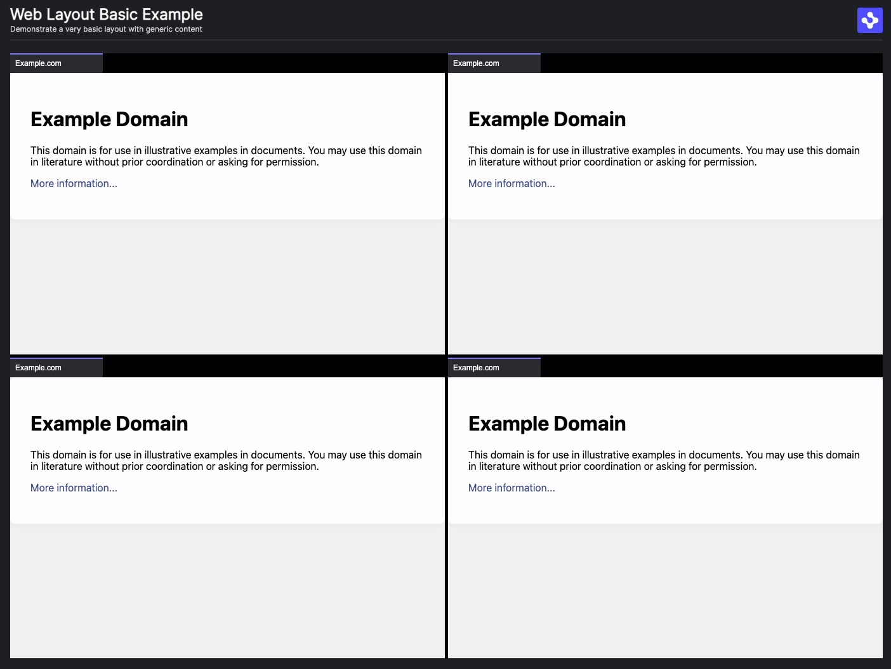

> **_:information_source: OpenFin:_** [OpenFin](https://www.openfin.co/) libraries are a commercial product and this repo is for evaluation purposes. Use of the OpenFin npm packages is only granted pursuant to a license from OpenFin. Please [**contact us**](https://www.openfin.co/contact/) if you would like to request a developer evaluation key or to discuss a production license.

# OpenFin Web Layout Basic

This is a simple example that has a simple provider web page that acts as the main/index page. This page wires up the interop broker and a layout using the [@openfin/core-web](https://www.npmjs.com/package/@openfin/core-web) library.

This page has a very simple layout which is made up of four iframes loading an external website (example.com).

[Live Launch Example](https://built-on-openfin.github.io/web-starter/web/v19.0.0/web-layout-basic/platform/provider.html)



## Getting Started

1. Install dependencies and do the initial build. Note that these examples assume you are in the sub-directory for the example.

```shell
npm install
```

2. Build the example.

```shell
npm run build
```

3. Start the test server in a new window.

```shell
npm run start
```

4. Launch the sample in your default desktop browser (or copy <http://localhost:6060/platform/provider.html> into your Desktop Browser).

```shell
npm run client
```

## Setup Notes

There are a few things to note before trying to use @openfin/core-web:

- If your [tsconfig](./client/tsconfig.json) file is using **node** for moduleResolution it will need to use **Node16** instead as export/imports are defined in the package.json of the @openfin/core-web npm package. This is required for when you try to import @openfin/core-web/iframe-broker.
- You will need to copy the shared-worker.js file from the [@openfin/core-web](https://www.npmjs.com/package/@openfin/core-web) npm package to your public folder. We have created a [copy-core-web.js](./scripts/copy-core-web.js) script to do this and it is referenced in the build-client npm command.
- You will need to copy the styles.css file for styling the layout from the [@openfin/core-web](https://www.npmjs.com/package/@openfin/core-web) npm package to your public folder. We have created a [copy-core-web.js](./scripts/copy-core-web.js) script to do this and it is referenced in the build-client npm command.

## How things are structured

### Host

The host is the entry point and it is the page that gets loaded into the Chrome/Edge/Safari/Firefox tab.

It has a responsibility to create a connection providing a broker url and then initializing the broker providing an id (**this id will be needed by your content when it wishes to connect if inheritance is not enabled**).

```javascript
import { connect } from "@openfin/core-web";

/**
 * Initializes the OpenFin Web Broker connection.
 */
async function init(): Promise<void> {
 // Get the dom element that should host the layout
 const layoutContainer = document.querySelector<HTMLElement>("#layout_container");

 // Get the default layout
 const layoutSnapshot = {...};

 // Connect to the OpenFin Web Broker and pass the default layout.
 // It is good practice to specify providerId even if content is explicitly specifying it for cases where
 // this provider uses our layout system and content uses inheritance. currentContextGroup
 // is useful for defaulting any client that uses inheritance through our layout system.
 const fin = await connect({ options: {
  brokerUrl: "http://localhost:6060/platform/iframe-broker.html",
  interopConfig: {
   providerId: "web-layout-basic",
   currentContextGroup: "green"
  }
 },
  connectionInheritance: "enabled",
   platform: { layoutSnapshot } });

 // You may now use the `fin` object to initialize the broker and the layout.
 await fin.Interop.init("web-layout-basic");
 // initialize the layout and pass it the dom element to bind to
 await fin.Platform.Layout.init({
  container: layoutContainer
 });
}
```

The host html page [provider.html](./public/platform/provider.html) then:

- imports this code and initializes it.
- brings in required content through the @openfin/core-web layout system.
- brings in the required css for the @openfin/core-web layout system.

The host page initializes the OpenFin layout system and brings in a required css file that styles the layout system. This styles.css is brought in from the [@openfin/core-web](https://www.npmjs.com/package/@openfin/core-web) npm package. This style is copied to the public/style folder as core-web-styles.css using our [scripts/copy-core-web.js](./scripts/copy-core-web.js) script. It runs as part of the build process.

### IFrame Broker

This is the iframe that is referenced by the Host and Content Providers (if they want to use the OpenFin API). The iframe broker html page and the shared-webworker.js file have to reside on the same domain as the **host**.

The [iframe broker html page](./public/platform/iframe-broker.html) uses the shared-webworker.js file that comes as part of the [@openfin/core-web](https://www.npmjs.com/package/@openfin/core-web) npm package. This script is copied to the public/js folder as shared-worker.bundle.js using our [scripts/copy-core-web.js](./scripts/copy-core-web.js) script. It runs as part of the build process.

The iframe broker needs some initialization logic as well.

```javascript
import { init as initBrokerConnection } from "@openfin/core-web/iframe-broker";

/**
 * Initializes the OpenFin Web Broker connection.
 * @returns A promise that resolves when the connection is established.
 */
async function init(): Promise<void> {
 // The shared worker is copied and renamed to the public/js directory from the @openfin/core-web package
 // using the scripts/copy-shared-worker.js file that is called when npm run build is called.
 return initBrokerConnection({
  sharedWorkerUrl: "http://localhost:6060/js/shared-worker.bundle.js"
 });
}
```

### Content

We simply load example.com in this example as the focus is on the layout and not content. If you wish to see how Content can use the OpenFin API please see the [web-interop-basic](../web-interop-basic/README.md) and [web-interop](../web-interop/README.md) examples.

#### Frame Name / Content Window Name

One thing we do show is how to set the iframe's window.name through meta data in your component state (this setting is ignored by the OpenFin Container but is used by the OpenFin Web Layout system). If you do set the frameName this will override OpenFin Layout naming and disable interop setting inheritance (if your content uses that).

Your content can still connect to the Web Broker, it just means the content needs to provide the broker related details instead of inheriting them from the platform when calling connect.

```json
{
  "type": "stack",
  "height": 50,
  "content": [
    {
      "type": "component",
      "componentName": "view",
      "componentState": {
        "url": "https://example.com",
        "name": "internal-generated-view-2d9a3624-fd0e-4e0a-b681-a79a9616b871",
        "web": {
          "frameName": "custom-name-disables-interop-inheritance-4"
        }
      },
      "title": "Example.com"
    }
  ]
}
```
