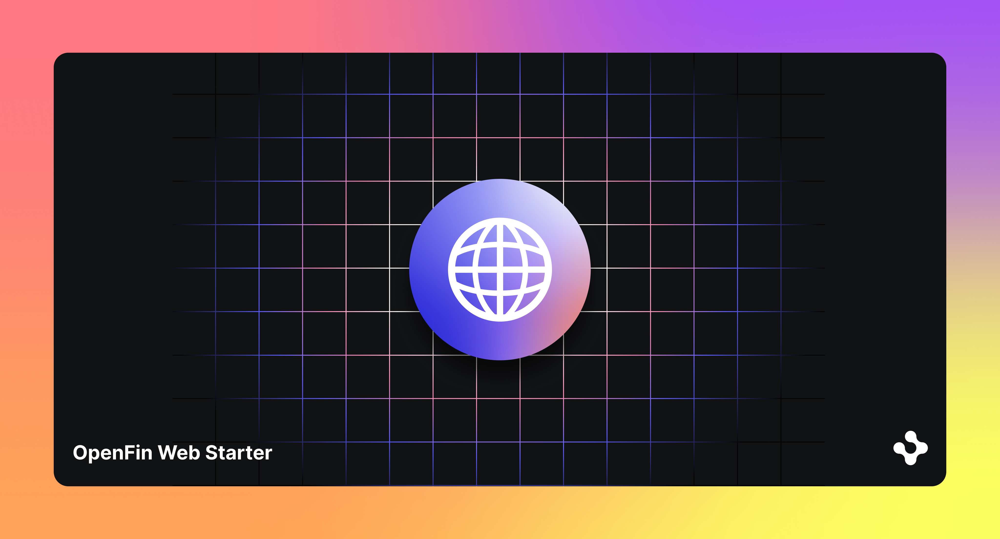

> **_:information_source: HERE:_** [HERE](https://www.here.io/) libraries are a commercial product and this repo is for evaluation purposes. Use of the OpenFin npm packages is only granted pursuant to a license from OpenFin. Please [**contact us**](https://www.here.io/contact/) if you would like to request a developer evaluation key or to discuss a production license.

# HERE Web Layout Prevent Reload

Moving a View between Core Web layouts used to reparent its iframe in the DOM, which forced a reload and destroyed whatever state the page held. This example shows the fix: a platform-owner-provided `sharedViewContainer` that owns every view iframe for its lifetime, so a cross-layout move rebinds the existing iframe instead of building a new one.

Two layouts render side by side. A button moves the `alpha` view between them, and a toggle turns the feature off so you can watch the old behaviour for comparison.

Requires `@openfin/core-web` **0.44.112** or later.

## Getting Started

1. Install dependencies. These examples assume you are in the sub-directory for the example.

```shell
npm install
```

2. Build the example.

```shell
npm run build
```

3. Start the test server in a new window.

```shell
npm run start
```

4. Launch the sample in your default desktop browser (or copy <http://localhost:6060/platform/provider.html> into your Desktop Browser).

```shell
npm run client
```

## The API

`sharedViewContainer` is an option on `fin.Platform.Layout.init()` — not on `connect()`. From the `@openfin/core-web` type definitions:

```typescript
export declare type WebLayoutInitOptions = Omit<OpenFin.InitLayoutOptions, 'layoutManagerOverride'> & {
  layoutManagerOverride?: OpenFin.LayoutManagerOverride<WebLayoutSnapshot>;
  /**
   * DOM element where view iframes are hosted. When provided, views
   * are created in this container and survive cross-layout moves
   * without iframe reload. The platform owner controls placement,
   * styling, and can observe this element directly.
   *
   * When omitted, each layout manages its own iframe container
   * (legacy behavior — cross-layout moves reload the iframe).
   */
  sharedViewContainer?: HTMLElement;
};
```

Supplying it is the entire change:

```javascript
await fin.Platform.Layout.init({
  container: layoutContainer,
  layoutManagerOverride,
  sharedViewContainer: document.querySelector('#shared_view_container')
});
```

You own the element, with one constraint: core-web writes **viewport-relative** inline coordinates onto the views it hosts (observed: `left: 21px; top: 132px`). The container must therefore be anchored to the **viewport origin** — `position: fixed; inset: 0`. Anchoring it to a positioned ancestor instead makes that ancestor's own offset get counted twice, pushing every view out of its pane. This isn't documented upstream, so it's worth calling out explicitly.

### Moving a view

Pass an existing view's **identity** to `Stack.addView`. Passing an identity rather than creation options is what makes core-web treat the call as a move:

```javascript
const layout = await fin.Platform.Layout.wrap({ uuid, name, layoutName: 'right' });
const root = await layout.getRootItem();
// getRootItem() gives you a ColumnOrRow or a TabStack; walk down to a stack.
const stack = root.type === 'stack' ? root : (await root.getContent())[0];
await stack.addView({ uuid, name: 'alpha' });
```

Internally core-web scans the other layouts for a view with that name, closes it there, and — when a `sharedViewContainer` is present — reuses the existing view object rather than constructing a new one. The match is on view **name**, so names in your layout snapshot need to be stable.

## How to tell a reparent from a reload

The views in this example are deliberately loud about it. Each one shows four independent signals:

| Signal                              | After a reparent | After a reload    |
| ----------------------------------- | ---------------- | ----------------- |
| Background colour (random per load) | unchanged        | new colour        |
| `Alive for` timer                   | keeps counting   | resets to `00:00` |
| `Page loads` counter                | unchanged        | increments        |
| Whatever you typed in the box       | still there      | gone              |

Try it:

1. Type something into `alpha` and let the timer run for a few seconds.
2. Click **Move alpha → right**. Everything survives — that is the reparent.
3. Click **sharedViewContainer: ON** to reload the page with `?shared=off`.
4. Move `alpha` again. New colour, empty box, timer reset, load count up — that is the reload.

If you prefer devtools, the Network tab shows no new document request for `stateful-view.html` on a reparent. The on-page counter is the same evidence without needing devtools open, which is handy on a screen share.

This was verified directly: a marker stamped on the view iframe's `contentWindow` before a move survived the move only when `sharedViewContainer` was supplied, with the same `of-view` DOM element persisting and colour, load counter and typed text all unchanged — including across a left → right → left round trip. With `?shared=off`, the same move destroyed the marker, re-rolled the colour, wiped the typed text and bumped the load counter, while the view itself still ended up in the target layout either way.

## Dragging between layouts

Dragging a view's tab into the _other_ layout does not move it — dropping `alpha`'s tab onto the right layout's tab bar left `alpha` in the left layout. The gesture isn't inert: Golden Layout still processed it, and the tab order _within_ the left layout changed. The drop is simply not accepted by a different layout instance, which matches Golden Layout 2 not sharing drag context between separate `LayoutManager` instances. Dragging within a single layout works normally — ordinary Golden Layout behaviour, unaffected by this feature.

There's a second reason a cross-layout drop is hard to land: because `#shared_view_container` is `position: fixed; inset: 0`, the hosted view iframes overlay the layout panes and capture pointer events over the content area. A drop aimed at a pane's content is blocked by the iframe; only headers and tab bars are reachable as drop targets.

This was checked with a scripted drag (Playwright `dragTo`) at a 1440x900 viewport. Given the result, the **Move** button is the supported path for a cross-layout move in this example — drag does not work across layouts, and nothing here promises it will in future.

## How things are structured

- `client/src/provider.ts` — connects to the broker, creates both layouts through a `layoutManagerOverride`, wires the toolbar, and passes `sharedViewContainer` to `Layout.init`.
- `client/src/content/stateful-view.ts` — the view page. No OpenFin dependency; it just makes reloads visible.
- `public/layouts/default.layout.fin.json` — the two-layout snapshot. View names `alpha`, `beta` and `gamma` are what reparenting matches on.

Unlike [web-layout](../web-layout/README.md), which shows one layout at a time behind tabs, every layout here stays visible — you cannot watch a view move between layouts you cannot both see.

## Setup Notes

The same notes as [web-layout-basic](../web-layout-basic/README.md) apply:

- If your [tsconfig](./client/tsconfig.json) is using **node** for moduleResolution it needs **Node16** instead, as imports are defined in the package.json of the @openfin/core-web npm package.
- The `shared-worker.js` and `styles.css` files must be copied from the @openfin/core-web package into your public folder. [copy-core-web.js](./scripts/copy-core-web.js) does this and runs as part of `npm run build`.
