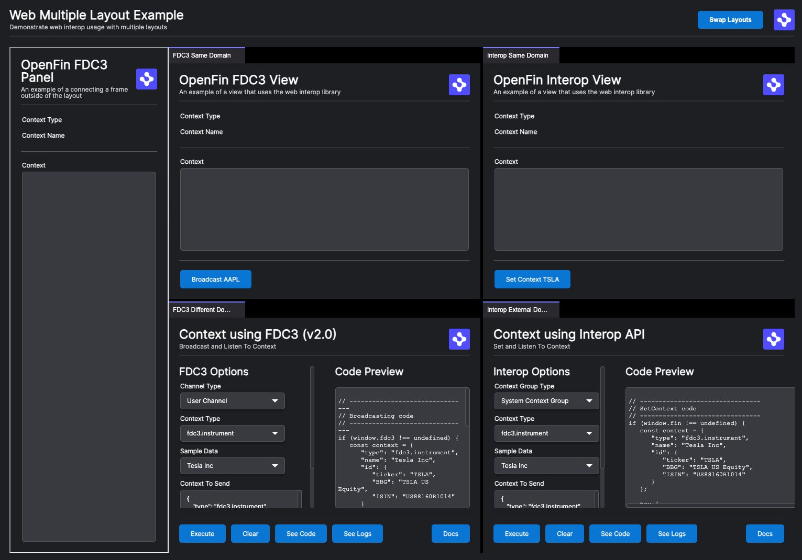

> **_:information_source: OpenFin:_** [OpenFin](https://www.openfin.co/) libraries are a commercial product and this repo is for evaluation purposes. Use of the OpenFin npm packages is only granted pursuant to a license from OpenFin. Please [**contact us**](https://www.openfin.co/contact/) if you would like to request a developer evaluation key or to discuss a production license.

# OpenFin Web Layouts

This is a simple example that has a simple provider web page that acts as the main/index page. This page wires up the interop broker and a layout using the [@openfin/core-web](https://www.npmjs.com/package/@openfin/core-web) library.

This page has a very simple layout which is made up of four iframes that inherit the interop settings they should use to connect to the web broker:

- Local - An FDC3 View - This uses the FDC3 API to add a context listener and to broadcast a hardcoded context object.
- Local - An Interop View - This uses the OpenFin Interop API to add a context listener and to set context using a hardcoded context object.
- External - An FDC3 Tool used in our workspace platform starters that lets you experiment with context sharing using the FDC3 APIs.
- External - An Interop Tool used in our workspace platform starters that lets you experiment with context sharing using the OpenFin Interop API.

It also has a left panel which is outside of the OpenFin Layout and represents a platform specific panel which simply uses fdc3 and logs what it receives. This iframe does not inherit interop settings (as it is not part of the OpenFin layout) and uses platform specific settings to connect.

Using Layouts, this demo also shows off a "Swap Layouts" function, which allows someone to quickly jump from one created layout (via a snapshot JSON definition) to another.

[Live Launch Example](https://built-on-openfin.github.io/web-starter/web/v20.1.0/web-layout/platform/provider.html)



## Getting Started

1. Install dependencies and do the initial build. Note that these examples assume you are in the sub-directory for the example.

```shell
npm install
```

2. Build the example.

```shell
npm run build
```

3. Start the test server in a new window.

```shell
npm run start
```

4. Launch the sample in your default desktop browser (or copy <http://localhost:6060/platform/provider.html> into your Desktop Browser).

```shell
npm run client
```

## Setup Notes

There are a few things to note before trying to use @openfin/core-web:

- If your [tsconfig](./client/tsconfig.json) file is using **node** for moduleResolution it will need to use **Node16** instead as export/imports are defined in the package.json of the @openfin/core-web npm package. This is required for when you try to import @openfin/core-web/iframe-broker.
- You will need to copy the shared-worker.js file from the [@openfin/core-web](https://www.npmjs.com/package/@openfin/core-web) npm package to your public folder. We have created a [copy-shared-worker.js](./scripts/copy-shared-worker.js) script to do this and it is referenced in the build-client npm command.

## Things to know when using Layouts

### LayoutManagerOverride

When providing more than one layout snapshot to define your view, it is necessary to override the existing layout init function when starting your application.

```javascript
fin.Platform.Layout.init({ layoutManagerOverride, container: PARENT_CONTAINER });
```

This allows us to call a function in the LayoutManager class called applyLayoutSnapshot that takes a container element, id string for its name, and a layout object to inject your snapshot layout in the desired container in the view.

By overriding some of the existing layout functions that you might be used to if you've used our Platform API before, we can now pass an larger object (found in /public/layouts/default.layout.fin.json) with multiple layouts, and iterate the creation of them into the DOM.

```javascript
function layoutManagerOverride(Base: LayoutManagerConstructor):
 LayoutManagerConstructor {
   /**
    * @class LayoutManagerBasic
    * This implementation is the fundamental override for Multiple Layouts in Web.
    */
    return class LayoutManagerBasic extends Base implements LayoutManager {
     public layoutMapArray: LayoutManagerItem[] = [];

     public layoutContainer = document.querySelector<HTMLElement>("#layout_container");

     /**
      * Override for applying multiple snapshots.
      * @param snapshot The layouts object containing the fixed set of available layouts.
      */
     public async applyLayoutSnapshot(snapshot: WebLayoutSnapshot): Promise<void> {
      console.log(`Does this exist? ${Boolean(this.layoutContainer)}`);
      if (this.layoutContainer !== null && this.layoutContainer !== undefined) {
        await Promise.all(Object.entries(snapshot.layouts).map(async ([layoutName, layout], i) =>
          createLayout(fin, layoutName, layout, i))
        );

       console.log("Layouts loaded");
      }
     }
     };
   };
```
